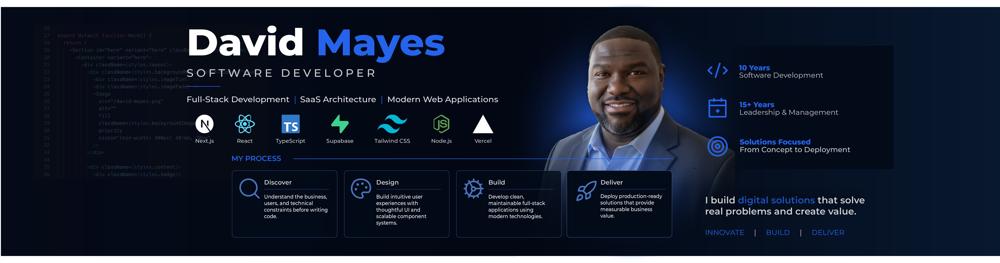

  

<h1 align="center">Hi, I'm David Mayes 👋</h1>

  <strong>Full-Stack Software Engineer • SaaS Developer • UI/UX Designer</strong>

  I build modern, production-ready web applications that combine clean architecture, scalable engineering, and exceptional user experiences.

  <a href="https://linkedin.com/in/davidamayes">LinkedIn</a>
  •
  <a href="mailto:dmayes77@gmail.com">Email</a>
  •
  <a href="https://davidmayes.dev">Portfolio</a>

---

# 🚀 About Me

I'm a full-stack software engineer passionate about designing and building scalable SaaS platforms and modern web applications.

My work focuses on creating software that is:

- Scalable
- Maintainable
- Responsive
- Accessible
- Business focused

I primarily build with **Next.js**, **React**, **JavaScript**, **Supabase**, and **PostgreSQL**, while emphasizing clean architecture, reusable components, and intuitive user experiences.

---

# 🛠 Core Technologies

### Frontend

- Next.js (App Router)
- React
- JavaScript (ES6+)
- HTML5
- CSS3
- Tailwind CSS
- Material UI

### Backend

- Node.js
- Server Actions
- REST APIs

### Database

- Supabase
- PostgreSQL
- Firebase
- Firestore
- MySQL
- MongoDB

### Cloud & Developer Tools

- Git
- GitHub
- Vercel
- VS Code
- Figma
- Adobe Illustrator

---

# 🚀 Featured Projects

## 🚗 CLIX MX

**Premium membership platform for mobile vehicle care.**

### Highlights

- Responsive mobile-first experience
- Secure authentication
- Lead management dashboard
- Admin portal
- Conversion-focused UX
- Production-ready architecture

### Built With

- Next.js
- React
- JavaScript
- Supabase
- PostgreSQL
- Server Actions
- Vercel

---

## 🏠 InspectOS _(Active Development)_

**Multi-tenant SaaS platform built for home inspection companies.**

### Highlights

- Multi-tenant architecture
- Inspection workflows
- Dashboard analytics
- Photo management
- Role-based permissions
- Responsive workspace

---

## 🌐 Personal Portfolio

A modern portfolio showcasing engineering case studies, UI/UX design, and production-ready software projects.

---

# 🎯 Current Focus

I'm currently focused on:

- Building scalable SaaS platforms
- Modern Next.js architecture
- Responsive UI/UX design
- Component-driven development
- Performance optimization
- Accessibility
- Clean software architecture

---

# 💡 Engineering Philosophy

I believe great software balances engineering excellence with exceptional user experience.

Every project I build is guided by four principles:

- Clean Architecture
- Reusable Components
- Scalable Systems
- Thoughtful Design

Whether developing internal business software, SaaS platforms, or customer-facing applications, my goal is always the same:

**Build digital solutions that solve real problems and create value.**

---

# 📫 Let's Connect

**Email**

📧 dmayes77@gmail.com

**LinkedIn**

💼 https://linkedin.com/in/davidamayes

**Portfolio**

🌐 Coming Soon

---

> _"I build digital solutions that solve real problems and create value."_

